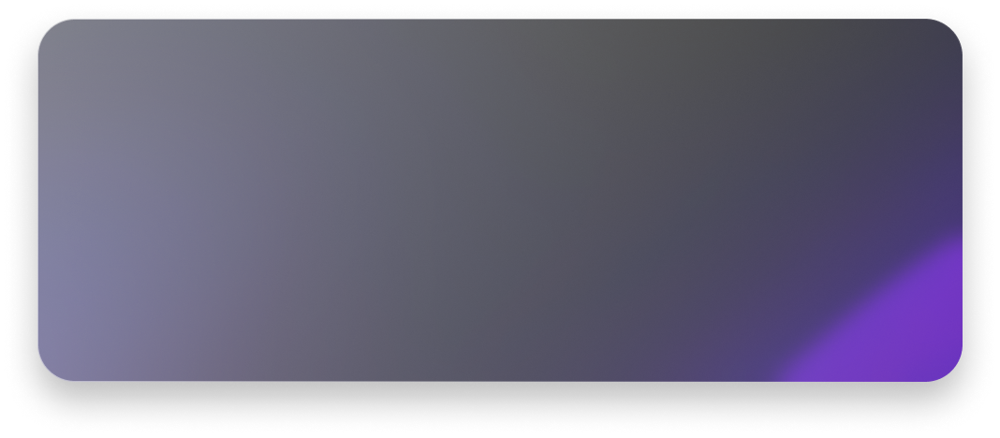
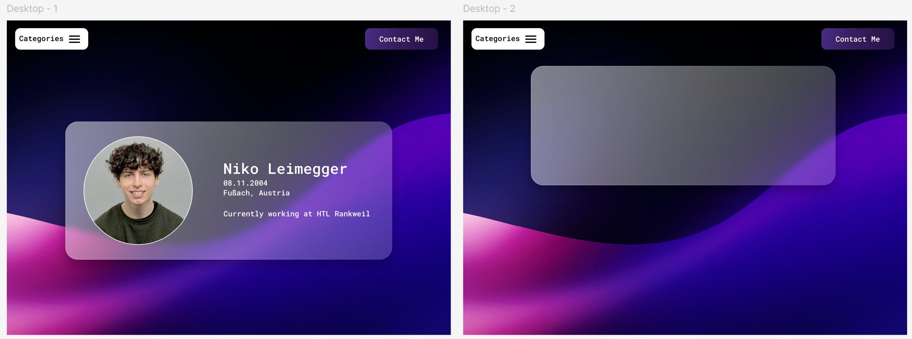

# HomePage

#

Um Bewerbungen interaktiver zu gestalten und das React-Framework zu erlernen, habe ich mich dazu entschieden, diese Website zu erstellen. Mit Figma wurde außerdem ein modernes Design erarbeitet, welches den Stil des "Glassmorphism" nachbilden soll.

## Website

Die [Website](https://tee6.github.io/HomePage/) wird mittels GitHub Pages gehostet und kann hier aufgerufen werden: https://tee6.github.io/HomePage/
## Figma Designs

Die ersten Figma Designs schauten wie folgt aus:

## Backlog

Bei der Mobile Ansicht der Website kommt es selten zu Fehlern im zusammenhang mit dem Dropdownmenu

## LinkedIn

